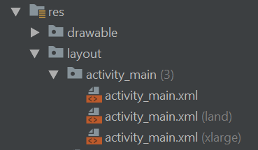

# Fragments

Es una parte de la interce que vive dentro de una Activity y puede ser reutilizado por multiples Activities.

**onCreate()**

El sistema lo llama cuando crea el fragmento. En tu implementación, debes inicializar componentes esenciales del fragmento que quieres conservar cuando el fragmento se pause o se detenga y luego se reanude.

**onCreateView()**

El sistema lo llama cuando el fragmento debe diseñar su interfaz de usuario por primera vez. Para diseñar una IU para tu fragmento, debes devolver una View desde este método que será la raíz del diseño de tu fragmento. Puedes devolver nulo su el fragmento no proporciona una IU.

**onPause()**

El sistema llama a este método como el primer indicador de que el usuario está abandonando el fragmento (aunque no siempre significa que el fragmento se esté destruyendo). Generalmente este es el momento en el que debes confirmar los cambios que deban conservarse más allá de la sesión de usuario actual (porque es posible que el usuario no vuelva).


## Implementación

Al utilizar fragmentos es necesario cambiar nuestra activity de **AppCompactActivity** a **FragmentActivity**.

```java
public class MainActivity extends FragmentActivity {
```

Usar los fragmentos en la activity

```xml
<?xml version="1.0" encoding="utf-8"?>
<LinearLayout
    xmlns:android="http://schemas.android.com/apk/res/android"
    xmlns:tools="http://schemas.android.com/tools"
    android:layout_width="match_parent"
    android:layout_height="match_parent"
    tools:context=".Activities.MainActivity"
    android:orientation="vertical">

    <fragment
        android:layout_width="match_parent"
        android:layout_height="0dp"
        android:layout_weight="50"
        tools:layout="@layout/fragment_data"
        android:id="@+id/dataFragment"/>

    <fragment
        android:layout_width="match_parent"
        android:layout_height="0dp"
        android:layout_weight="50"
        tools:layout="@layout/fragment_details"
        android:id="@+id/detailFragment"/>


</LinearLayout>
```

## Interactuar entre fagments

Crear un contrato en el origen de los datos que se ejecutará en el Activity que contiene el fragment.

```java
public interface DataListener{
    void SendData(String name);
}
```

Obtener instancia desde el método en el se sobrescribio del contrato con el **Fragment Manager**

```java
@Override
public void SendData(String name){
    DetailsFragment detailsFragment =
            (DetailsFragment) getSupportFragmentManager().findFragmentById(R.id.detailFragment);
    detailsFragment.GetData(name);
}
```

## Diseño flexible

Si se quiere ser flexible en los diseños por ejemplo en landscape o una tablet, debemos generar un layout del mismo nombre que el layout principal.


